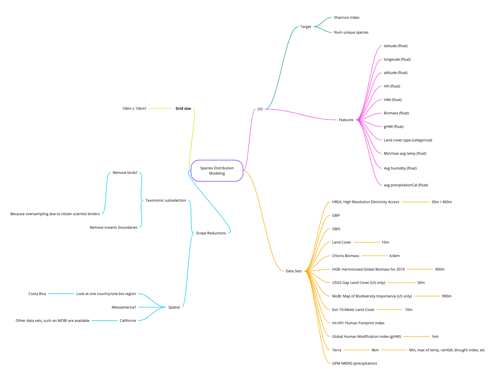

# Feature Engineering for Species Distribution Modeling

## Team members

Ando Shah (@ando-shah) and Shravan Kumar Undaru (@undaru96)

## Objective

Pre-processing (Data cleaning, de-biasing and feature engineering) of spatial datasets (GBIF, HMI, HFI, Climate etc.) to feed a deep learning model for predicting count of unique species.

- Our analysis will explore variation of the count of unique species across:
	- the number of occurance in GBIF
	- Human Modification Index / Human Footprint Index
	- Biomass
	- Climate (terra for max temp, min temp, avg humidity)
	- Landcover type

Scope for the project is limited using following considerations:
	- Geographic: Costa Rica
	- Terrestrial (as opposed to terrestrial and marine)
	- Taxonomic: In consideration (inclined to remove birds due to citizen science oversampling) 
	- Temporal: All time

## Motivation

Our observation that GBIF has a lot of sampling bias particularly in the global south. Our aim is to accurately predict the count of unique species in areas with fewer observations.

## Methodology
We will look at our region of interest (ROI), which we are limiting to terrestrial Costa Rica, as it has a relatively high number of observations within the GBIF dataset. We will sample regions within the ROI that are in the top few quantiles of occurence density, and split those regions into equally sized grids, of say 1km X 1km (TBD). Let's call this, the sub-ROI. These becomes the observations, or rows in the final rectanular dataframe, that include the lat/long/altitude of the center of that grid.

We will subset all other feature datasets to the sub-ROI and extract those features to the final observations dataset. In the next phase we will train a model (or ensemble of models) with this dataframe, after conducting a randomized train-test split.

## Mind Map

## I/O

These are our initial estimates of features and target variables we aim to use. After the analysis phase, we will likely reduce the number of variables.

### Targets
Number of species: this will be our initial metric that the model will aim to predict, as a naive starting point. We may try to incorporate Shannon diversity index later

### Features
- Latitude (float)
- Longitude (float)
- Altitude (float)
- Human Footprint Index (HFI) / global Human Modification Index (gHMI) - (raster/NetCDF)
- ESRI 10m land cover (categorical)
- Terra Climate data (rainfall, min/max temperatures, humidity, etc)
- Chloris Biomass (float)

## Data Sources

Most of the data sources are from Microsoft's [Planetary Computer Stac's](https://planetarycomputer.microsoft.com/catalog).

The [HFI dataset can be found here](https://mountainscholar.org/handle/10217/216207), and the [gHMI here](https://figshare.com/articles/dataset/Global_Human_Modification/7283087).

